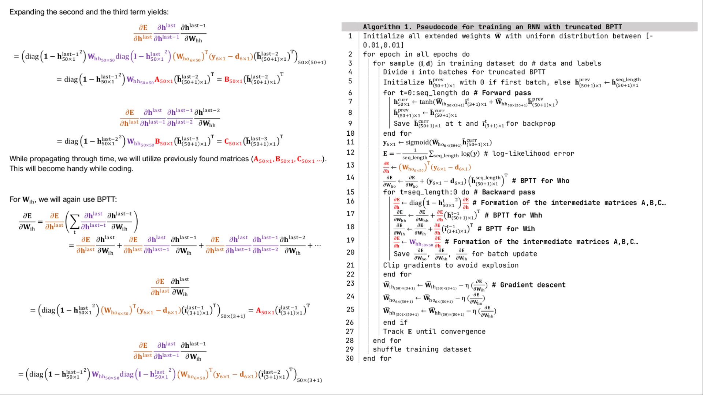
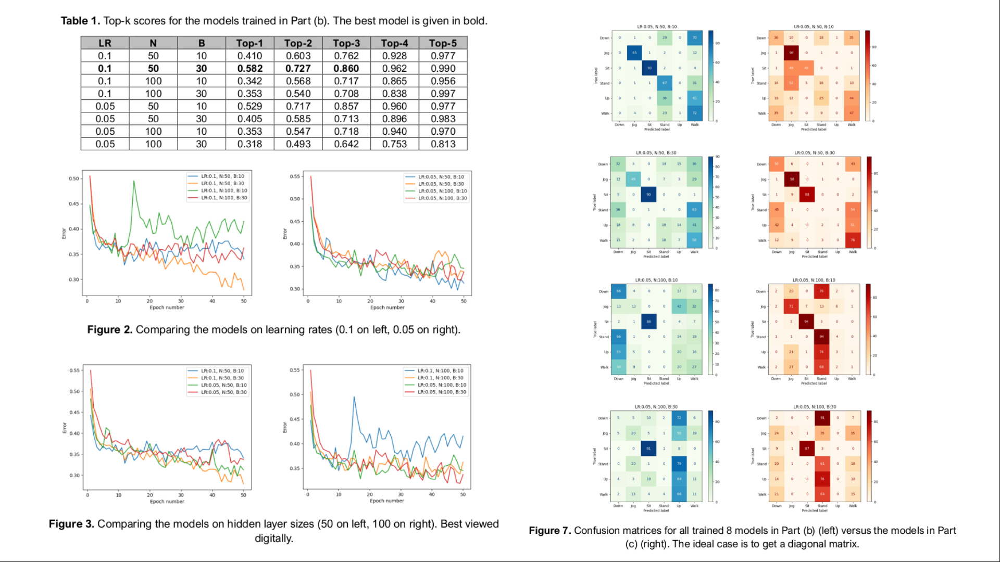

# nn-scratch-EEE543
Bilkent University 2024 Spring EEE543 Neural Networks assignments. Includes implementations of MLP and RNN from scratch, written in Python.

The code and the reports include thorough derivations of the methods and extensive experiments for the following three projects.

Some snippets from the reports:

* **Project 1:** 2-layer-perception implementation, trained on MNIST.
* **Project 2:** Recurrent neural network (RNN) implementation, trained on a human action recognition dataset, with truncated backpropagation through time (TBPTT) algorithm.
* **Project 3:** 3-layer-perceptron implementation, trained on a human action recognition dataset. Utilized softmax activations, dropout, and momentum.
